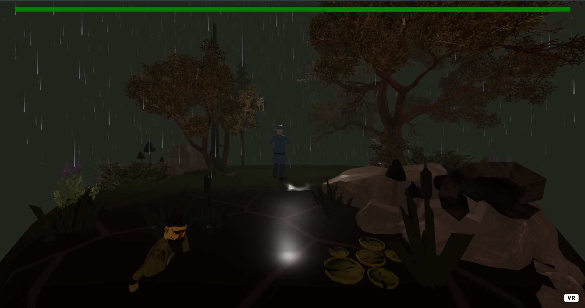

# NedKelly_A-Frame_Project 
A small supplimentary game for my honours/book on Game Feel.

## About
Ned Kelly Project is a small proof of concept highlighting game design techniques for a book I am developing expanding from 

## Image

## Built With
* [A-Frame](https://aframe.io/) - Providing a more intuitive framework for WebGl
* [Draco Compression](https://google.github.io/draco/) - For optimising/compressing my environment so it loads more efficently online. 
